#SourceTree/Git轻指南
#~~15分钟学会使用Git~~
##### 作者：Mark24
##### 邮箱：mark.zhangyoung@qq.com
##### 时间：2016.09.02


##开头聊聊天##

之前的15minGit是很不成熟的一篇手记，在内容在关键的地方有所欠缺，所以打算更新下。一方面把自己的一些使用经验记录下，另一方面希望给新手提供一点指导，Git的命令比较混乱，一个命令也会有多种功能，所以对新手不太友好。

我不想一上来就命令行，我打算先介绍一下SourceTree的用法，顺带着讲讲Git。两边同时并进。

之前的一篇对SVN充满浓浓的鄙视，哈哈，年轻不懂事……

一旦提到编辑器，马上就有Vim，Emacs之战。版本控制也差不多，Git和SVN永远有谁好谁坏的争论。其实SVN和Git都差不多。他们更像是对待同一个问题，有人倾向于A解决办法，有人倾向于B，于是设计的方案有所差别，关注的点也有点区别，但是大家本质上还是都去解决这个问题—— 版本控制。条条大路通罗马，大家做的都不错。只是各有所长罢了。

现在也愈发觉得，你很难直接的去判断一个东西的好和坏，尤其是工具。很多东西不好非黑即白的去分辨。就像我在后面会介绍图形界面软件SourceTree如何使用Git，也会去相应介绍Git命令行。

有人觉得图形不好，其实我觉得在熟练Git命令行之前，熟悉一下图形也挺好。图形和命令行也是相辅相成的，不一定谁就是高贵，谁就是低贱。还是那句话，各有所长，各取所需。都会最好。


##版本控制是什么？##

这段是给小白看的，讲了一大堆主语，最后就是不解释主语，谁看了也会头疼。版本控制，简单的说，就是一个保存记录你文件的东西。

举个例子：在没有版本控制软件之前，大家是怎么工作的呢？
你在写作/写代码/写论文，反正你在编辑什么东西，然后写的感觉差不多了，就保存起来。突然上司/导师有了个新想法，需要你修改一些东西，然后你就硬着头皮修改，聪明点的人，会另存一个版本。于是时间久了，就会有：

* xxx论文正式版
* xxx论文最终版
* xxx论文绝对不该版
* xxx论文真的不改了
* xxx论文真的真的不改了
……

这种类似的经历可能大家都有过。版本控制就是做这个工作，无论是Git还是SVN都可以把每次修改，保存起来，每个版本都会看起来像时间轴一样，方便管理。你可以切换到任何编辑的时间点，查看每次递进修改了什么。可以撤销，会退到任何时候。

还有就是，版本控制也在多人参与一个项目或者文件的编辑，方面做了工作。设想一下一个宏大的项目，很多工程师参与其中；或者一本书的编辑，很多校对、翻译参与其中。

其实版本控制应用场景相当的广泛，所有有了那句—— 编程从版本控制开始。

##Git VS SVN##

我现在保持的观点是，两者没有好坏，可是初学者还是会纠结两者，总想选择一个『好的』，这样子一劳永逸。这是正常的心态。选择Git的人，就会来看这篇笔记。在你们心里，一定觉得Git是『正确』的选择。

我还是那个观点，两个工具，就像是两个人，对于版本控制这个问题，不同的看法衍生出的不同的解决方案，从而写出来的不同的软件。目的都是一样的。只是设计思想和使用方式有区别。

我们来聊聊他们的关键性的区别。

### SVN ###

看一下SVN的模型。


大家能看的出，比较简洁，实际上SVN使用的时候也是比较简单的。Windows上面推荐 TortoiseSVN非常好用(个人觉得，对应的Windows平台面向Git的TortoiseGit很难用，个人不推荐，后面再讲原因)，Mac上推荐Cornerstone(别用SmartSVN,这个软件简直是软件设计的反面教材——我只想说，打开完界面，所有人都是一脸懵逼。)

当然，GUI能办到的，命令行一样都能办到，而且会快的多。时间富裕的同学可以去研究一下SVN的官方文档。

简单点说，SVN的最大特点就是集中式，它会把代码保存在中央服务器上。没错，整体上来看，你得自己搞一个服务器，这个服务器就是用来储存代码/文件。然后大家不论是提交还是下载都去访问这个服务器，除了这个服务器，没有任何人拥有全部代码 —— 当然除非你整个目录下载下来。

SVN的权限设计的比较完整，可以精确到目录、文件。这个被很多企业所欢迎，因为处于安全考虑，不让任何人拿到代码是政治正确。但是也带来了问题 —— 中央服务器如果被干掉了，也就意味着，没有任何人能恢复代码库，每个人手上的都是代码片段。这也就是Git宣称他们比SVN先进的地方，Git是分布式的。

但是我个人觉得，这很牵强。因为中央服务器可以持续的备份，各种稳妥的备份方案。即使是Git分布式的，也不排除所有人都把代码丢了。。。。好吧，我在抬杠。

SVN的分支功能好像很弱。合并分支和文件的时候比较慢。好了到此打住，我们聊聊主角Git。

### Git ###

Git的特点就是采用了分布式设计。号称各种优越。我个人觉得所谓的『优越』，只能说Git起步比较晚，完全可以总结前人的设计，还有就是Git是设计用来为Linux内核做版本控制的，Linux内核项目可以说相当的变态，Git需要不断的改良适应这个应用场景，也造就了它的优秀。毕竟是在实际项目中考验出来的。

Git让每个人都能下载到当时的完整代码，服务器本身和每个人的电脑没有什么区别，仅仅是大家约定都向中心服务器提交而已。但是实际上，每个人都可以下载到完整代码。这样子，你可以在本地任意的切换和编辑。与SVN每次的下载和上传都要和中央服务沟通不同的是，Git在本地也拥有一个虚拟的代码储存的地方，术语叫做本地仓库，总之，结果上来看，就是你可以先把代码储存在本地，先保存起来。也是跟时间轴似的，不需要依赖中央服务器。等你重新连接到网络，可以再上传到中央服务。这个小小的功能看起来没什么，但是SVN不支持。SVN脱离了网络什么都做不了。Git不一样。

至于这部分怎么用，后面会提到。我们抓住重点，大概知道个什么情况，这样子不会一脸懵逼，看了半天不知道Git要做什么。

不过网上有个段子，就是Git的离线提交代码是个伪功能，因为Git的命令过于随意和复杂，所以开发人员都需要Google命令 怎么用。所以离开了网络，根本没法用git……哈哈

### 聊聊Git的工作模型 ###

我们看一下Git的工作流程。
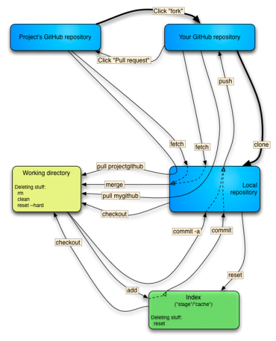

比较复杂。教程之后，你应该能看懂一二了。
没事，这种工具性质的，反正你又不需要理解其中实现原理，你只要知道怎么用就行了。唯熟而已。放松，下面我们开始吧。

先来聊聊 git flow —— Git设计了自己的一套flow流程。没错，凭空产生，你非要说什么依据，可能就是参照SVN和BitKeeper(Linus之前用的这个，后来Linux社区和这家母公司产生商业纠纷，Linus决定自己写一个版本控制软件——这就是Git的起源。)优化了整体流程产生的流程了吧。反正遵照就是了，这是『Git的正确打开方式』。这也是Git的设计。在以前我很想为Git的这套设计找一个理由 —— 后来觉得，人家不断地在Linux内核工作中检验总结出来的，再以此为参考，校准Git的流程，这就是Git的设计。实用性设计。

这地方，强制自己熟悉一下。如果你也像我一样，一定要为所有事情寻找个理由的话。用我们大学物理老师的口头禅——遇到不理解的，你先承认一下。等走通了，你大概能就明白当初疑惑之处了。

上个图：

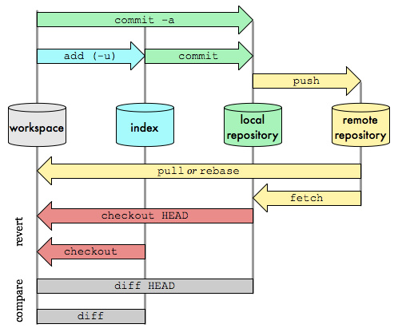

这幅图，既是Git的设计，也是Git的flow。我们围绕这幅图讲解一下吧。解释一圈，大概也知道个什么情况了。后面我们操作一遍。看不懂就多看几遍。


首先看这张图中间，四个圆柱 ：

* workspace:工作区，就是你正在写的代码
* index：暂存区，一个本地的缓冲区
* local repository：本地仓库
* remote repository：远程仓库

属于比较生硬，我来一一解释一下：

* #####workspace工作区

就是你正在写的代码，正在打开的编辑器里面的内容，解释完了，就这样。

比如你在用编辑器Sublime打开了一个文件，那么你看到的这个就是工作区。工作区内容被改变了，意味着你的编辑器里面的内容也会变化。

* #####index暂存区

index照理应该翻译叫索引，这里叫暂存区。暂存区是干嘛的？你可以理解成这是Git提供的一个储存的空间。这里可以临时保存一些你提交的记录。这个是本地的。暂存区是Git和SVN的最重要的差别之一。

* #####local repository本地仓库

你可以把临时的代码提交到index暂存区，然后暂存区积攒的挺多了，就把代码提交到本地仓库，本地仓库，你可以理解成，git提供的一个特殊区域，这里保存的是，你的每个正式版的代码。

看名字可以看出来，从1-3都是在本地工作，3就是储存本地最终代码的。

到此为止，都是在本地工作。

* #####remote repository 远程仓库

远程仓库，其实就是服务器那头的储存空间。本地代码可以发送到服务器，让服务器保存起来。

如果是个人的话，就你一个在提交，无所谓什么汇总，远程服务器就相当于云存储的功能，就是云盘，连上网络可以在任何地方下载。

如果是多人参与的项目，服务器就是大家约定的提交代码的地方，服务器就像中枢一样，不断的汇总整个团队的最新成果。相当于所有人的云盘。

---

#### 工作场景

上面的那幅图，箭头的方向其实就是每次提交代码流动的方向，箭头上的文字，就是git的命令。

下面介绍几个常用的工作场景，这样就能应用在实际的工作学习中。

---

####场景1：创建仓库，提交代码。

这是最最常见的场景了。

1. 首先创建仓库

    仓库，这个词，翻译的很生疏。反正把仓库理解成一个储存空间就对了。我们创建一个仓库，就是创建一个储存空间，和当前的文件关联起来。这个储存空间会每次监视你的输入和改动，并且根据你的命令做一些行为，比如储存起来。

    剧透一下，除了远程仓库在服务器上，其他的储存空间其实都在目录下`.git` 文件夹下，这里保存了所有的信息。所谓的创建git仓库，也就是在目录下创建这样子的一个目录，这里会保存历史信息。当然如果你把目录删掉了——那就变成普通文件目录了。

    先走着吧，边走边核对。

    首先，我们新建一个远程仓库。

    这边使用的SourceTree的版本是2.3.1。大家自行下载一下，这个客户端除了大文件慢一点，没有什么死角，UI和命令都比较靠谱。TortoiseGit执行的命令和解释的命令不太一样，很多地方，没法预估，实际工作中还会覆盖队友的代码。反正相信我，ST的质量比较高。比较可靠。
    


    * 创建仓库

    很傻瓜式，我们现在只创建本地仓库，做实验。ST里继承的很友好，你也看到了，这个菜单栏里有很多种方式，之后可以自行慢慢探索。
    

    建立一个 `st_test`项目目录

    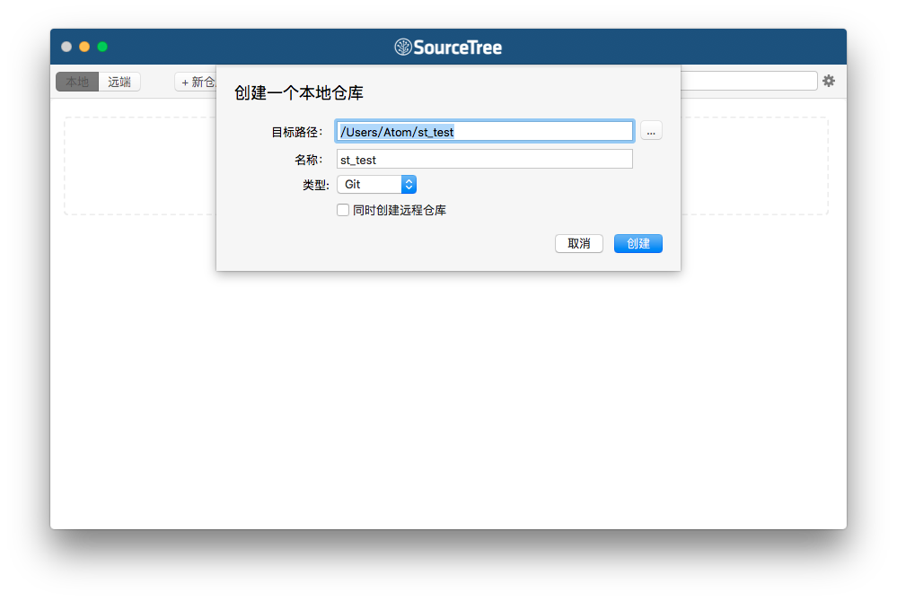

    接着就会得到一个目录
    这里就是工作目录，常用的Git都在这里可以找到。
    

    上面一排，提交、拉取、推送，新人看到了是不是会哭，会一脸懵逼，怎么和书上的不一样。你可以在设置里，切换英文。
    

    这样子可以看得清晰点：

        * 克隆 —— clone
        * 添加 —— add
        * 检出 —— checkout
        * 提交 —— commit
        * 拉取 —— pull
        * 推送 —— push
        * 抓取 —— fetch
        * 分支 —— branch
        * 合并 —— merge
        * 暂存 —— stage
        * 丢弃 —— discard

    用Sublime打开目录，新建文件。马上ST那边就能收到。
    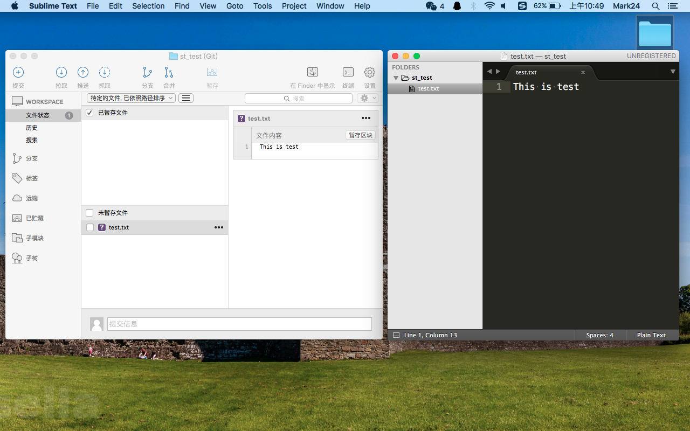

    让我们来看一下
    

    上面的菜单栏里都是Git的原生属性，拓展命令栏，就是ST自带的，已达到快捷设置。然后是左侧的分类栏，这边是一切快速切换 。比如WORKPLACE分类，这边的：

        * 文件状态： 一般我们修改完了，点到这边，能看到如图的这些区域。

        * 历史：如果你切换到历史就能看到提交记录组成的时间轴。

        * 搜索：不提

    分支分类：

        * 本地分支：你在这边可以查看到本地分支的状态

    远端：

        * 远程分支：这边就是服务器那边分支的情况。

---

接着来讲一下实际的操作。在刚才的目录里创建文件，在ST的工作区就能看到新增文件。
我们这个时候需要勾选我们期望的文件，提交到暂存区

填写一下commit信息，Git里，commit这边不能为空

点击完提交了,WORKPLACE就被清空了，切换到『历史』，就可以看到这次提交的时间轴。
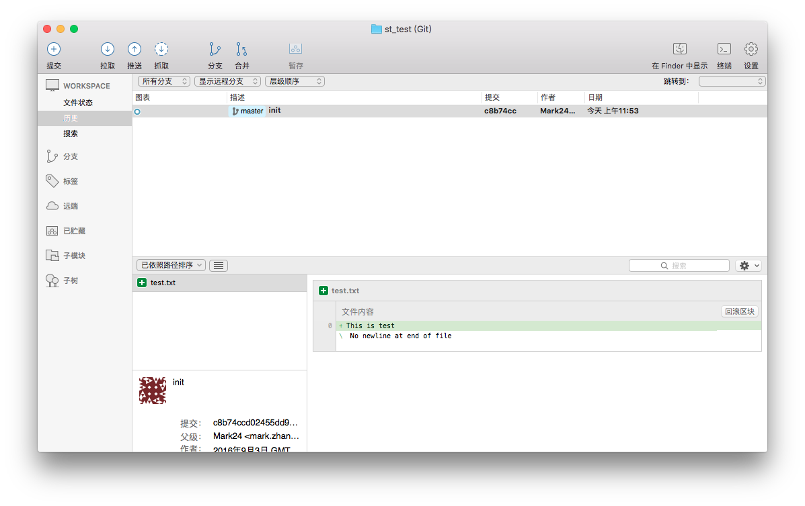
一次好像看不出什么效果，反复几次：

`修改文件 —— 工作区提交到 暂存区 —— 填写commit信息提交`

> 注意： 其实你细心可以观察到，文件的图标变成黄色了。是的，这个地方是需要关注的，Git对于文件是有区分状态的。
最开始是个紫色的`问号?`这是ST提供的友好提示。意味着，这个文件是新建的，还没有添加到Git的监视中，一旦被添加一次，以后对于这个文件，就是修改状态。就是下面的黄色的状态。


下面用gif演示一下整个过程：


看完了这个过程是不是还觉得是挺简单的？

红框部分，就是分支图谱，在这边你能看到自己的提交的时间线。
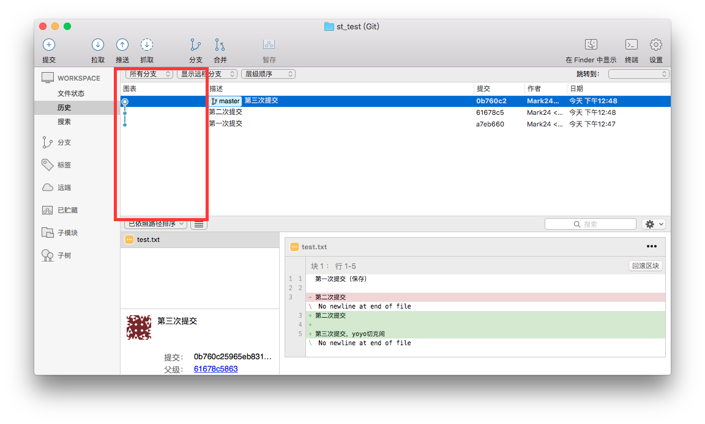


> 场景1：简单的提交信息，就到此为止。我们仅仅完成了这幅图例红框的部分。


---

### 命令行介绍

下面我们用 命令行来完成这一系列的操作试试。

1. 新建Git仓库

` git init `

[基础的命令行操作参考](http://www.runoob.com/linux/linux-command-manual.html)

我们只要打开一个目录，执行 `git init`，就会在当前工作目录下生成 `.git` 文件夹，Unix/Linux系统下，这个文件是隐藏的，因为文件名前加个点，是隐藏文件的意思。

* `mkdir st_test2` 新建一个叫做 st_test2的目录

* `cd st_test2` 进入目录

* `git init` 在目录下初始化git

到此为止，就是ST刚才新建的本地仓库的操作，是等效的。


2. 然后在目录下新建一个  `test.txt` ,编辑一下什么内容

3. 编辑文件结束后
    一般是这样，黑黑的命令行，我们会搞不清楚情况，这时候文件的状态。所以有一个命令，非常常用，就是查看当前文件的状态。
    `git status` 这个命令的作用其实就是ST图形界面的作用，ST显示的更加彻底，还有diff的状态。

    * `git status` 查看当前仓库的状态

    显示有一个 test.txt 文件没有被追踪.untracked files写的很清楚。这就在告诉你，这是新的文件，需要你特意添加到 git的追踪下。

    ```
    On branch master

    Initial commit

    Untracked files:
      (use "git add <file>..." to include in what will be committed)

        test.txt

    nothing added to commit but untracked files present (use "git add" to track)

    ```

    * `git add .` 把当前所有文件添加进入git追踪

    add 命令后面的 `.` 是通配符，意思是当前目录下所有文件。

    add 命令有两种方式：如果这个文件是新文件，还未被追踪，那么你`git add`就是添加到git的追踪；如果这个文件是老文件了，你只是在修改它，`git add`就是把修改片段提交到`暂存区`。

    add后面也可以加上具体的文件名，也可以用通配符，批量选择文件。

    操作结束，我们看一下 `git status` 再次检查下状态。
    这里显示，暂存区里有一个文件，待commit。意思就是，暂存区里有一个文件，还没有被提交到本地仓库。

    ```
    On branch master

    Initial commit

    Changes to be committed:
      (use "git rm --cached <file>..." to unstage)

        new file:   test.txt


    ```

    下面我们就要正式提交了。`git commit -m '第一次提交'`，`-m`参数，后面跟上的是提交信息，就是打一段文字，记录到底做了什么，方便到时候回来能想起来。

    输入`git commit -m '第一次提交'`我会看到：

    ```
    [master (root-commit) da496b1] 第一次提交
     1 file changed, 1 insertion(+)
     create mode 100644 test.txt

    ```
    这表示，我们的信息已经提交了。你可以做再运行`git status`查看下状态。

    ```
    On branch master
    nothing to commit, working tree clean
    ```
    这表明，暂存区已经没有什么需要提交了。目录是干净的。
    这就是我们需要达到的最终在状态。

通过gif看的清楚一点
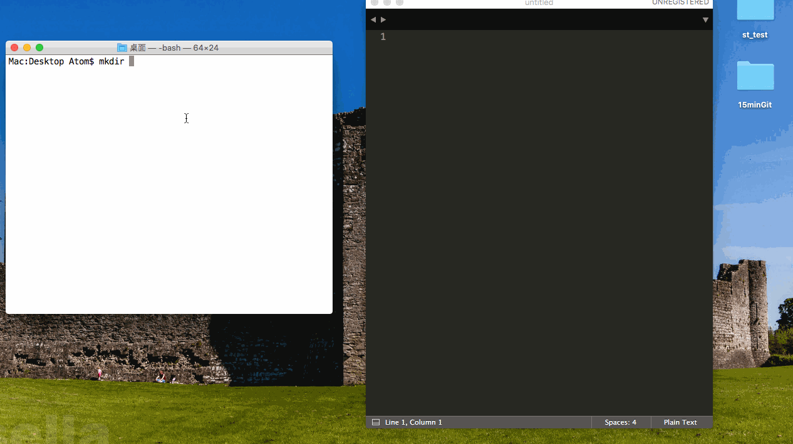


####建议

> 我们也可以把已经git初始化后的git目录拖动到 ST里面，会有惊喜。我们喜欢这种方式。命令行的有点在于执行速度快，但是不直观。所以一般都是混合使用。项目目录拖动到ST里面。通过ST里面的图形化来看看每次修改的地方，然后再命令行里执行 `git add`,`git commit`这些操作在ST里面，一单文件数量庞大，会非常的慢。这样子使用了GUI的直观，也利用了CLI的速度。


---

###### 总结一下

其实你只要熟悉ST的界面，脑子里面建立一个数据流动的心理模型就好了。每次的操作，我们都通过`git status`来明确我们目前处在流动模型的什么位置。然后再来决定下一步的动作。

目前我们用到的命令

* `git init` 初始化仓库，会在当前目录下生成一个 `.git` 文件夹。

* `git status` 查看当前状态。通过这个状态时刻去判断我们下一步要做什么。

* `git add .` 把当前目录下所有文件，添加进`暂存区`/添加新文件到git追踪。

* `git commit -m '提交信息'` 填写信息提交到本地仓库


---


####场景2：通过分支，来完成个人工作

这个场景，就是一个人在独立工作的时候。什么是分支呢？分支就像是平行世界。之前我们已经看到了，整个的Git提交记录会像时间轴一样，不断地延伸。每个点都是我们提交的一次记录。可以通过ST感受一下。分支呢，就是从这个点，开始向另外一种方向去延伸。

一般什么时候会用到分支呢？一般是这样子的，我们不断地提交的时候，会遇到这种情况，下面会做一个需求，但是我拿不准，我有两个想法，一个是A一个是B，我也不知道哪个靠谱。所以我决定用分支来解决，我建立一个实验性的分支A，然后不断在的在里面提交，试验我的想法。如果试验成功，我可以选择把分支合并到 主分支上。如果失败，我可以删除A分支。重新建立一个B分支，继续工作。这就是分支在个人使用中的妙用。

建立在上面的基础上，我们来看看如何建立分支。


填写一下分支名


然后我们能看到界面上在发生变化。

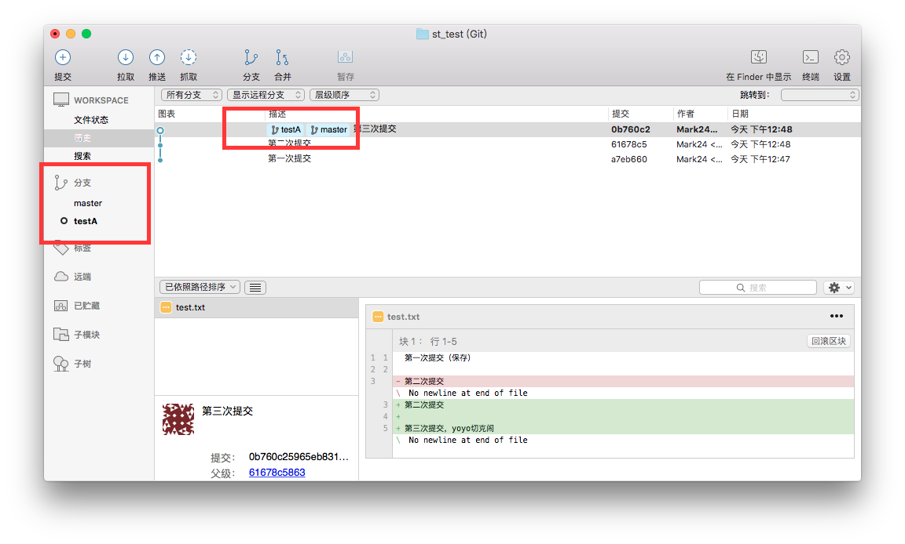

左面的快速切换，能看到分支信息，这里粗体指示我们所在的分支。这就是平行世界，你可以通过双击在这里快速切换。

##### 注意：
要把自己的工作区清理干净才能切换，否则可能会丢失自己工作区、暂存区里面的内容。

可以提交干净，或者使用 stage 暂时保存一下。这个后面再说吧。

我们可以根据上面的经验，无论在ST里面还是命令行里，不断地提交几次。

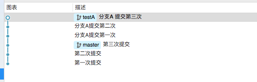

可以看到 testA 分支的记录在 master上。对了，分支分支，差点又忘介绍主语了。从我们刚开始建立仓库开始，git就分配给我们一个分支，我们称呼为 主分支，默认分支名就是master。所以其实一开始，我们就进入了以主分支为基础的代码提交了。

这部分如果有不理解的地方，可以查看下 [廖雪峰Git教程](http://www.liaoxuefeng.com/wiki/0013739516305929606dd18361248578c67b8067c8c017b000)来看一下他对于分支的描述。还有可以参考一下[《ProGit》](https://git-scm.com/book/zh/v2)。这是一本非常不错的书，如果你有耐心看到最后，肯定收获颇丰。

####合并分支

合并分支关键的在于，你先要切换到某个目标分支，然后让别的分支，合、并、过、来。
也就是说，你在testA分支上不断地提交，现在你觉得差不多了。你想合并到master。那么你需要先切换到 master分支，然后把 testA合并过来。这有一个参照关系。

st里面合并很简单。

* 比如我想把testA合并到master最后以master为主。那么我就要县切换到master分支。然后选择`合并分支`


可以通过筛选，找到目标分支，然后选择。就可以进行合并。我们这里是很简单的情况，master分支并没有被持续开发。如果出现master这边也在被人同步开发，也就是一个团队在工作的时候，合并的时候，其实就是写入文件的过程，如果是同一个文件，同一行，被不同人改写了。就会出现冲突。解决冲突的情况，我们后面单独拉出来说。这里就讲最简单的合并情况——要知道实际工作中遇到的情况复杂多了，不可能一一列出。但是万物归宗的道理我们都懂。


合并完。你会发现分支的时间轴上面，master赶上testA了。表示这两个进度达成一致。


最后用Gif演示一下整体流程：
保存按钮被遮挡了，勿介意。


### 命令行介绍

还是依照惯例，介绍对应的命令行。

ST有图形界面，所以没有那么难了解情况，但是命令行就不一样，他需要不断地去通过命令去了解目前的分支情况。

`git branch` 这个命令用来了解目前分支的情况。


`*` 所指向的就是你目前所在分支。其他的表示目前本地的其他分支。

`git checkout <分支名>` 用这个命令在不同分支之间去切换。


混乱的地方要来了，一个命令多种用法。

`git branch <分支名>` 用这个命令去创建一个分支。


`git checkout -b <分支名>` 这个命令是创建，并且切换到该分支。
等价于按顺序执行两个命令：

* `git branch <分支名>`

* `git checkout <分支名>`


这就是混乱的地方，命令并没有什么设计感，也没有什么逻辑 —— 肌肉记忆吧。反正命令已经饱受吐槽了。

不过我的个人建议，初期可以按照直觉性的去使用命令。

`git branch` 罗列分支信息

`git branch <分支名>` 创建分支

`git branch -d <分支名>` 删除分支

`git branch -D <分支名>` 强制删除分支

`git checkout <分支名>` 切换分支


避免使用 `git checkout -b <分支名>` 这种反直觉的。不过随意啦，我相信，打的多了，一定会强迫自己使用简化命令的。懒，是程序员的美德。

`git merge <分支B>` 合并分支命令。如果你所在分支A，这个操作将会把B分支的内容合并到A上。


---

####场景3：多人协作，分支+解决冲突

前面已经讲完：

* 创建git仓库

* 基本的提交操作

* 分支与合并

下面我们讲一下解决冲突。一般多人协作的情况下，更容易产生冲突。所以我打算模拟一下多人协作的情景。这里更重点的是强调，解决冲突的方法，其实很简单。一通百通的东西。

其实多个人协作的时候，本质就是多个分支合并的时候出现的冲突。为什么这么再说呢，我一直在讲本地仓库的工作，一直没有提远程仓库。其实远程仓库就是一种变相的本地仓库。多人协作的的时候，每个人从服务器下载代码，都会在本地生成代码仓库，并且要在一个选定的分支工作。每个人提交的时候，只会遇到两种情况 —— 1.单一分支上，你的提交和别人的提交冲突了，但是实际上，本地会将你的代码以一个临时分支的情况去和目标分支合并，最后还是两个分支合并。2.不同分支合并的时候，两个分支的代码冲突了。所以其实多人协作本质上和创建多个分支，然后去合并，没有啥区别，或者说可以这样子去理解。

捎带脚的解释一下什么是冲突——所谓冲突就是双方同时对同一个文件的同一个地方/同一部分产生修改。于是计算机知道信谁个好，计算机是很傻的，它不知道内容，无法分辨上下文，不知道你们心中所想。所以解决冲突的问题，只能交给人类来处理。Git的机制是，不解决冲突，你无法提交。Git会智能的去尝试合并，但是一旦出现冲突，文件会被标记成特殊状态。你一定要解决冲突，再去提交。问题解决了，文件才会回归到正常状态。

回归最朴素的方法，你去找那个出现冲突的文件。Git会给你标记处哪里出现问题。然后对于你来说，找到这个文件，查询这个文件提交的commit记录，是谁提交的，去找到这个人。你们两个在现实生活中去协商，当面聊也好，电子邮件，QQ也好。反正你们共同决定，冲突这部分，谁的代码留下来，还是两部分都留下来。有人可能觉得自己能看懂，就自己解决。其实并非这样，大多数都是项目庞大，分工变得非常细致。很多时候，你也不知道这地方别人的代码意义是什么，所以你们必须彼此交流。确保这地方不会出现问题。最后确认了。提交人负责解决冲突，再次提交一次。

这就是解决冲突的整个过程。

我们分别通过st和命令行来模拟一下这个过程。

首先我们先创建出一个仓库，包含两个冲突的分支。上面那段已经说了，两个不同的分支，编辑了同一个文件的同一个部分。合并的时候会冲突。利用前面的，我们不论在ST上还是CLI上都可以轻易的制造出这个情况。

ST流程：

* 新建一个仓库 st_test

* 在仓库中添加一个文件text,并且编辑内容为 "基础demo"

* 提交到本地仓库（先到暂存区，然后commit）

* 创建个分支 testA

* 切换到testA分支下，继续编辑这个文件，直接修改第一行为"testA"

* testA分支下，提交，本地clean

* 切换到master分支

* 你会发现文件还原了。恩，符合刚才我们说的，平行世界的描述。我还是编辑第一行，"master" 我们就这样子成功的制造冲突。冲突就在text文件的第一行。master分支写的是"master",testA分支写的是"testA"。

* master分之下，尝试把testA合并过来。看看会发生什么。

合并的时候，ST会给出友好提示：
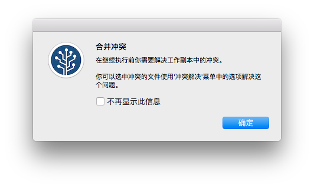
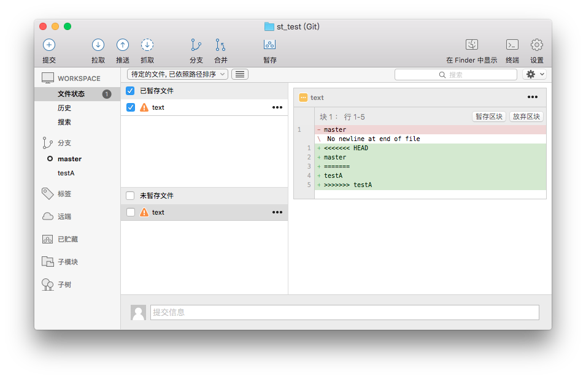
我们能看到文件的状态确实发生状态了。而且Git修改了文件。我们用Sublime打开文件来看看什么情况。
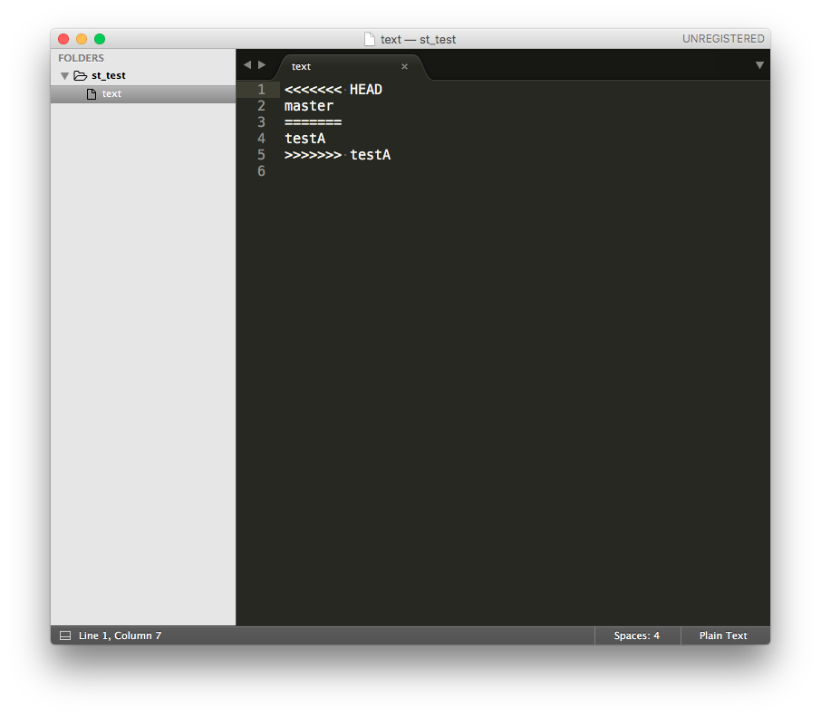
文件里被插入了奇怪的字符。其实这事git的一种提示。

```
<<<<<<< HEAD
master
=======
testA
>>>>>>> testA
```

`HEAD` 是一个指针变量，它指向谁，就表明你在哪个分支。比如你在`master`分支的时候，`HEAD` -> `master`。基本上就是这个情况。你在其他分支的时候同理。
所以这里 `HEAD`开头和`=====`之间的部分就是指当前你的修改。而下半部分，就是合并分支的部分，这块 testA其实是我的提交信息。

好了，我们下面要解决冲突。要做的就是找人协商——由于我自己做的，我不要协商。
我有三种选择 —— 1.删除我的保留别的分支的 2.删除别的分支的，保留我的 3.去掉奇怪的乱入的符号，保存大家的。

ST给了友好的策略,能帮你省点事。当然直接去编辑文件也是可以的。
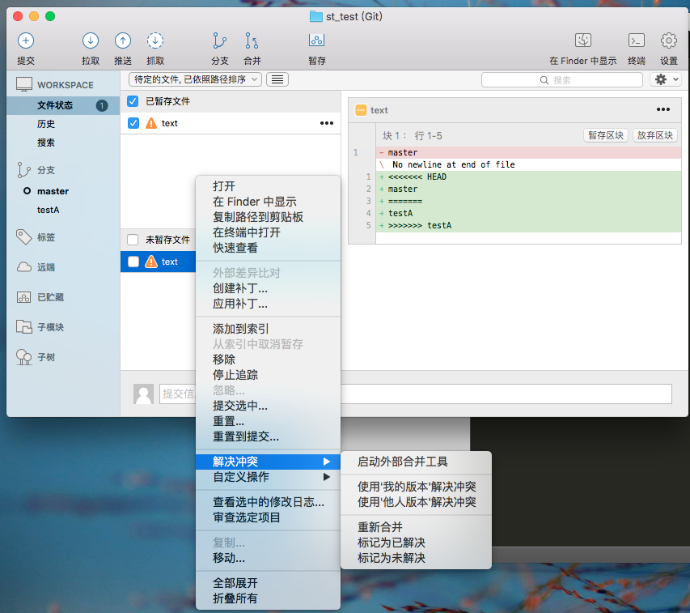

就直接手动去改代码。改成这个样子。真的好朴素啊。解决冲突是个既不高大上，也不专精尖的活儿。


然后你再勇往直前的去正常提交一次就好了。

最后你会在图谱上看到一个分支合并的轨迹。
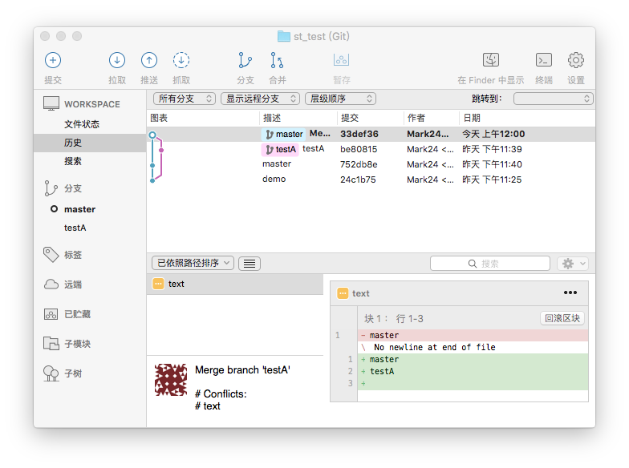

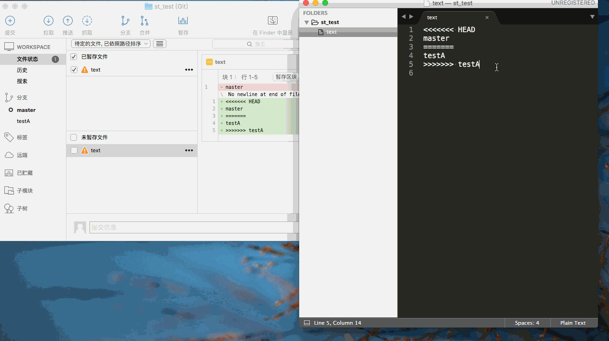

---

####命令行

`git merge <分支B>` 合并分支B

这里会发生冲突

```
Auto-merging text
CONFLICT (content): Merge conflict in text
Automatic merge failed; fix conflicts and then commit the result.
```

除非你解决冲突，否则你不能进行任何操作。

接着必然去编辑文件。然后回来继续提交。


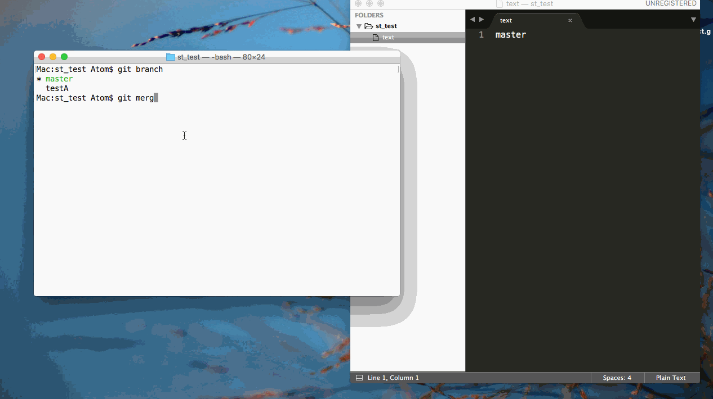

到此为止，解决冲突的部分结束。

---

###后记

最近换了新的工作环境，比较忙碌。随着工作生活应用的越多，后面我还想追加一些东西。

其实还有挺多地方可以提。

比如：

* 一个傻瓜式的完整的流程是什么样子的。

* 如何配合Github来工作。

不过我也不断地在学习。这篇不免有纰漏，欢迎指正。

---

资源声明:图片来自于互联网
版权声明:自由转载-非商用-非衍生-保持署名（创意共享3.0许可证）

---

###反馈

可以在issue中反馈，欢迎交流，共同进步

---

###打赏

如果你觉得本文章质量不错，读后收获很大，不妨小额赞助我一下，让我有“动力”继续致力于高质量文章和教程

微信


支付宝


